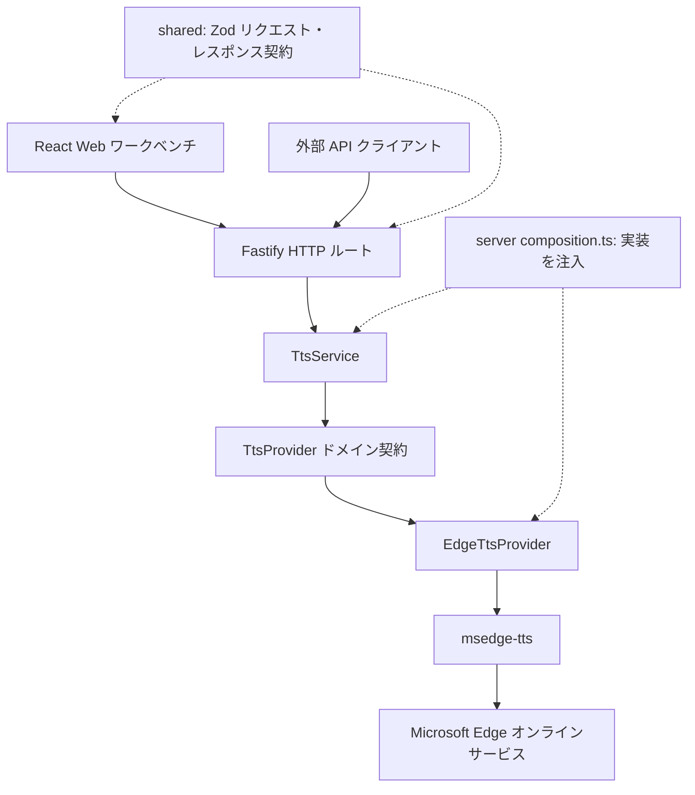

# edgeTTS

[](https://github.com/DejavuMoe/edgeTTS/releases)
[](https://github.com/DejavuMoe/edgeTTS/actions)
[](LICENSE)
[](https://github.com/DejavuMoe/edgeTTS/pkgs/container/edgetts)
[](package.json)

[English](README.md) | [简体中文](README.zh-CN.md) | 日本語

edgeTTS は Microsoft Edge のオンライン音声サービスを利用するセルフホスト API と Web ワークベンチです。MP3 ストリーミング合成、音色一覧、最大 20,000 Unicode コードポイントの長文に対応します。

> [!NOTE]
> edgeTTS は Microsoft Edge TTS オンラインサービスを利用しています。アップストリームの可用性や音声カタログはマイクロソフトにより管理されています。edgeTTS は独立したオープンソースプロジェクトであり、マイクロソフト社との提携や推奨関係はありません。

> 合成時は本サーバー経由でテキストを TLS 通信により Microsoft に送信します。edgeTTS は合成テキストや音声を永続保存しませんが、オフラインエンジンではありません。TXT 読み込みはローカルで行い、合成時にテキストを送信します。Microsoft 側のデータ処理は本プロジェクトの管理外です。

## 主な機能

- **音声 API**：`/v1/audio/speech` は OpenAI 音声リクエスト形式の一部に対応し、Edge 音色 ID と MP3 出力を使用します。`/api/speech` は長文と速度・ピッチ・音量調整に対応します。
- **テキスト分割**：段落、改行、文末、空白を境界に Unicode 文字を保護して分割します。合成時は空白のみのチャンクを省略します。
- **並行処理の上限**：実行中 4 ストリーム、FIFO 待機 16 件。長文リクエストは合成全体で 1 つの実行許可を保持します。
- **Web ワークベンチ**：4 言語 UI、音色検索・お気に入り、ローカル TXT 読み込み、MP3 再生・ダウンロード。MediaSource 対応ブラウザーでは順次再生し、その他では Blob 全体の受信後に再生します。
- **簡単な配備**：単一 Fastify プロセスで UI と API を配信し、Bearer 認証とコンテナ保護設定を提供します。

## クイックスタート

### Docker Compose ビルド済みイメージ（推奨）

ディレクトリを作成し、`compose.yaml` を用意します：

```bash
mkdir -p ~/edgetts && cd ~/edgetts
```

```yaml
services:
  edgetts:
    image: ghcr.io/dejavumoe/edgetts:0.8.0
    container_name: edgetts
    restart: unless-stopped
    init: true
    read_only: true
    cap_drop:
      - ALL
    security_opt:
      - no-new-privileges:true
    tmpfs:
      - /tmp
    stop_grace_period: 35s
    ports:
      - "${EDGETTS_BIND_ADDRESS:-127.0.0.1}:${EDGETTS_HOST_PORT:-8080}:8080"
    environment:
      - NODE_ENV=production
      - HOST=0.0.0.0
      - PORT=8080
      - API_KEY
      - REQUIRE_API_KEY=${REQUIRE_API_KEY:-true}
      - SPEECH_RATE_LIMIT_MAX
      - SPEECH_RATE_LIMIT_WINDOW_MS
```

ランダムな API キーを生成してサービスを起動します：

```bash
(umask 077; set -C; printf 'API_KEY=%s\n' "$(openssl rand -hex 32)" > .env)
docker compose up -d
```

### 動作確認

```bash
curl -i http://127.0.0.1:8080/health
```

期待されるレスポンス: `HTTP/1.1 200 OK`、`{"status":"ok"}`。

ブラウザで `http://127.0.0.1:8080` を開くと Web ワークベンチが表示されます。

`.env` は初回だけ生成し、更新時に保持します。`/health` は HTTP プロセスのみを確認します。ローカルでは `http://127.0.0.1:8080`、リモートでは HTTPS プロキシの URL を開き、同じ API キーを入力します。シェル API 例を使う前に `set -a; . ./.env; set +a` でローカル生成キーを読み込みます。その他の配備方法と更新は[配備ガイド](docs/ja/deployment.md)を参照してください。

## API 利用例

### ネイティブ長文ストリーミング合成 (`POST /api/speech`)

両音声 API は最大 300 Unicode コードポイントのチャンクを順番に合成します。ネイティブ API の上限は 20,000 コードポイント、互換 API は 4,096 UTF-16 コード単位です。ブラウザーはダウンロード用に音声を保持するため、メモリ使用量は音声サイズに応じて増加します。

```bash
curl -X POST http://127.0.0.1:8080/api/speech \
  -H "Authorization: Bearer $API_KEY" \
  -H "Content-Type: application/json" \
  -d '{
    "input": "これは長文ドキュメントの内容です。edgeTTS はサーバー側で可逆分割を行い、単一の HTTP ストリームで全音声を配信します。",
    "voice": "ja-JP-NanamiNeural",
    "quality": "standard",
    "speed": 1.0,
    "pitchSemitones": 0.0,
    "volume": 1.0
  }' \
  --output long-speech.mp3
```

## ドキュメント一覧

[`docs/`](docs) ディレクトリにて詳細なドキュメントを提供しています：

| ドキュメント                                                           | 説明                                                                           |
| :--------------------------------------------------------------------- | :----------------------------------------------------------------------------- |
| [**セルフホストデプロイガイド**](docs/ja/deployment.md)                | Docker Compose、単一コンテナ、ソースビルド、Linux systemd のセットアップ手順。 |
| [**リバースプロキシ & TLS 設定**](docs/ja/reverse-proxy.md)            | Nginx・Caddy の設定例、ストリーミング非バッファリング原則、検証スクリプト。    |
| [**設定リファレンスマニュアル**](docs/ja/configuration.md)             | 環境変数一覧、認証仕様、レート制限、並行制御キューの詳細。                     |
| [**API リファレンス & 連携ガイド**](docs/ja/api.md)                    | エンドポイント仕様、スキーマ、エラーコード一覧、外部クライアント設定方法。     |
| [**リリースガバナンス & セキュリティ**](docs/development/releasing.md) | 厳格な SemVer 方針、OCI 署名検証、不変ダイジェスト固定の仕組み。               |

- [アブレーション結果（中国語）](docs/development/research/ablation.zh-CN.md)
- [長文合成の性能（中国語）](docs/development/research/performance.zh-CN.md)
- [アーキテクチャと設計判断（英語）](docs/development/architecture.md)
- [変更履歴（英語）](CHANGELOG.md)

## アーキテクチャ



実線は呼び出し、破線は共有契約と依存性注入を示します。

- `apps/server`: Fastify によるサービス統合、HTTP ルーティング、レート制限、静的アセット配信。
- `apps/web`: React + Vite ワークベンチ、アクセシブルな UI と音声再生。
- `packages/tts-service`: プロバイダー非依存のビジネスロジック（音色キャッシュ、並行リミッター、長文可逆分割）。
- `packages/tts-core`: ドメイン層の抽象定義とポート契約。
- `packages/edge-provider`: Microsoft Edge 音声読み上げ WebSocket アダプター。
- `packages/shared`: 共有バリデーションスキーマ、型定義、Unicode テキスト処理ユーティリティ。
- `deploy/`: 本番用 Compose ファイル、systemd ユニット、Nginx テンプレート。デプロイガイドと同期しています。
- `docs/`: `en/`・`zh-CN/`・`ja/` の 3 言語ユーザーガイド、自動生成の `openapi.json`、`development/` の開発者向け文書。
- `tests/`: アーキテクチャ境界、ドキュメント整合性、リリース管理のリポジトリ単位のチェック。
- `scripts/`: リリース前チェックとアブレーション実験のツール。

## ライセンス

本プロジェクトは [MIT License](LICENSE) のもとで公開されています。
