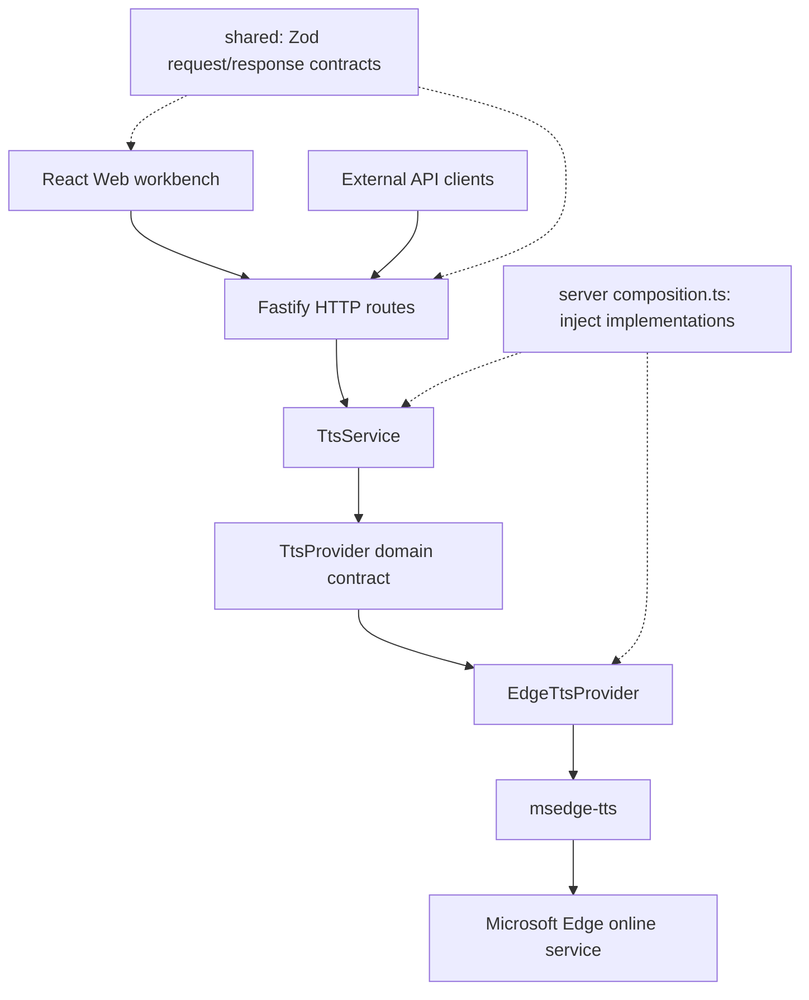

# edgeTTS

[](https://github.com/DejavuMoe/edgeTTS/releases)
[](https://github.com/DejavuMoe/edgeTTS/actions)
[](LICENSE)
[](https://github.com/DejavuMoe/edgeTTS/pkgs/container/edgetts)
[](package.json)

English | [简体中文](README.zh-CN.md) | [日本語](README.ja.md)

edgeTTS is a self-hosted API and browser workbench for Microsoft Edge speech synthesis. It supports MP3 streaming, voice discovery and long text up to 20,000 Unicode code points.

> [!NOTE]
> edgeTTS relies on the Microsoft Edge TTS online service. Upstream availability and voice catalogs are maintained by Microsoft. edgeTTS is an independent open-source project and is not affiliated with or endorsed by Microsoft.

> Synthesis sends your text through this server to Microsoft over TLS. edgeTTS does not persist synthesis text or audio; it is not an offline engine. TXT import only reads locally until you request synthesis. Microsoft’s handling of submitted data is outside this project’s control.

## Key Features

- **Speech APIs**: `/v1/audio/speech` accepts a subset of the OpenAI speech request format, with Edge voice IDs and MP3 output. `/api/speech` supports long text and speed, pitch and volume controls.
- **Text segmentation**: Splits at paragraph, line, sentence or whitespace boundaries while preserving Unicode. Whitespace-only segments are skipped during synthesis.
- **Bounded concurrency**: Four active streams, sixteen FIFO queue slots, and one permit held for each complete long-text request.
- **Browser workbench**: Four UI languages, voice search and favorites, local TXT import, MP3 playback and download. Streaming uses MediaSource where supported; other browsers wait for a complete Blob.
- **Simple deployment**: One Fastify process serves the UI and API. Bearer authentication and a hardened container configuration are provided.

## Quick Start

### Docker Compose with Pre-built Image (Recommended)

Create a directory and define `compose.yaml`:

```bash
mkdir -p ~/edgetts && cd ~/edgetts
```

```yaml
services:
  edgetts:
    image: ghcr.io/dejavumoe/edgetts:0.5.0
    container_name: edgetts
    restart: unless-stopped
    init: true
    read_only: true
    cap_drop:
      - ALL
    security_opt:
      - no-new-privileges:true
    tmpfs:
      - /tmp
    stop_grace_period: 35s
    ports:
      - "127.0.0.1:8080:8080"
    environment:
      - NODE_ENV=production
      - HOST=0.0.0.0
      - PORT=8080
      - API_KEY=${API_KEY:?Set API_KEY in .env}
      - REQUIRE_API_KEY=true
```

Generate a secure random API key and start the container:

```bash
(umask 077; set -C; printf 'API_KEY=%s\n' "$(openssl rand -hex 32)" > .env)
docker compose up -d
```

### Verify Deployment

```bash
curl -i http://127.0.0.1:8080/health
```

Expected response: `HTTP/1.1 200 OK` with `{"status":"ok"}`.

Open `http://127.0.0.1:8080` in your web browser to access the Web Workbench.

Generate `.env` only once and preserve it on upgrades. `/health` confirms the HTTP process, not Microsoft availability. Open `http://127.0.0.1:8080` locally, or your reverse proxy’s HTTPS URL for a remote server, then enter the same API key. Before using the shell API examples, load the locally generated key with `set -a; . ./.env; set +a`. Other deployment methods and upgrades are in the [deployment guide](docs/deployment.md).

## API Usage at a Glance

### Native Long-Text Streaming Synthesis (`POST /api/speech`)

Both speech APIs synthesize sequential segments of at most 300 Unicode code points. Native requests allow 20,000 code points; the compatibility API allows 4,096 UTF-16 code units. The browser retains audio for download, so memory grows with audio size.

```bash
curl -X POST http://127.0.0.1:8080/api/speech \
  -H "Authorization: Bearer $API_KEY" \
  -H "Content-Type: application/json" \
  -d '{
    "input": "这是一篇长篇文档的内容。edgeTTS 会在服务端无损分段并通过单个 HTTP 连接流式返回完整音频。",
    "voice": "zh-CN-XiaoxiaoNeural",
    "quality": "standard",
    "speed": 1.0,
    "pitchSemitones": 0.0,
    "volume": 1.0
  }' \
  --output long-speech.mp3
```

## Documentation

| Document                                               | Description                                                                         |
| :----------------------------------------------------- | :---------------------------------------------------------------------------------- |
| [**Self-Hosted Deployment Guide**](docs/deployment.md) | Docker Compose, single container, source build, and bare-metal systemd setups.      |
| [**Reverse Proxy & TLS Guide**](docs/reverse-proxy.md) | Production Nginx and Caddy setups, streaming buffer rules, and test scripts.        |
| [**Configuration Reference**](docs/configuration.md)   | Environment variables, authentication, rate limits, and concurrency queues.         |
| [**API Reference & Integrations**](docs/api.md)        | Endpoint specifications, schemas, error codes, and third-party client integrations. |
| [**Release Governance & Security**](docs/releasing.md) | SemVer policies, OCI supply-chain attestations, and immutable digest pinning.       |

- [Ablation results (Chinese)](docs/ablation.zh-CN.md)

## Architecture



Solid arrows show the call path; dashed arrows show shared contracts and dependency injection.

- `apps/server`: Fastify composition root, HTTP routing, rate-limiting, and static file hosting.
- `apps/web`: React + Vite SPA workbench featuring browser-neutral accessible UI primitives.
- `packages/tts-service`: Provider-neutral orchestration (voice caching, concurrency limiter, text segmentation).
- `packages/tts-core`: Domain abstractions and port definitions.
- `packages/edge-provider`: Microsoft Edge Read Aloud WebSocket provider adapter.
- `packages/shared`: Shared validation schemas, types, and Unicode text processing utilities.

## License

This project is licensed under the [MIT License](LICENSE).
