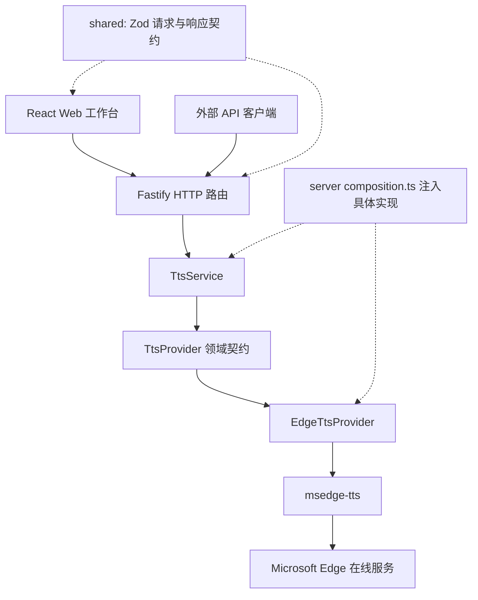

# edgeTTS

[](https://github.com/DejavuMoe/edgeTTS/releases)
[](https://github.com/DejavuMoe/edgeTTS/actions)
[](LICENSE)
[](https://github.com/DejavuMoe/edgeTTS/pkgs/container/edgetts)
[](package.json)

[English](README.md) | 简体中文 | [日本語](README.ja.md)

edgeTTS 是基于微软 Edge 在线语音服务的自托管 API 和 Web 工作台，支持 MP3 流式合成、音色查询和最多 20,000 Unicode 码点的长文本。

> [!NOTE]
> edgeTTS 依赖微软 Edge TTS 在线服务。上游服务的可用性与音色由微软维护。edgeTTS 为独立的开源项目，与微软公司无商业关联，亦未获得官方背书。

> 合成时，文本会通过本服务经 TLS 发送至微软。edgeTTS 不持久化合成文本或音频，但并非离线语音引擎。TXT 导入阶段仅在本地读取，点击合成后才提交文本；微软如何处理已提交数据不由本项目控制。

## 核心特性

- **语音接口**：`/v1/audio/speech` 支持 OpenAI 语音请求格式的子集，使用 Edge 音色 ID，输出 MP3；`/api/speech` 支持长文本及语速、音调、音量调节。
- **文本分段**：按段落、换行、句子或空白边界切分并保护 Unicode 字符；合成时跳过纯空白分段。
- **有界并发**：4 个活跃流、16 个 FIFO 排队槽位，长文本请求在整个合成期间持有一个许可。
- **Web 工作台**：四种界面语言、音色检索与收藏、本地 TXT 导入、MP3 播放与下载。支持 MediaSource 的浏览器渐进播放，其他浏览器等待完整 Blob 后播放。
- **简单部署**：一个 Fastify 进程托管前端和 API，提供 Bearer 认证及容器加固配置。

## 快速上手

### Docker Compose 预构建镜像（推荐）

创建部署目录并编写 `compose.yaml`：

```bash
mkdir -p ~/edgetts && cd ~/edgetts
```

```yaml
services:
  edgetts:
    image: ghcr.io/dejavumoe/edgetts:0.7.0
    container_name: edgetts
    restart: unless-stopped
    init: true
    read_only: true
    cap_drop:
      - ALL
    security_opt:
      - no-new-privileges:true
    tmpfs:
      - /tmp
    stop_grace_period: 35s
    ports:
      - "${EDGETTS_BIND_ADDRESS:-127.0.0.1}:${EDGETTS_HOST_PORT:-8080}:8080"
    environment:
      - NODE_ENV=production
      - HOST=0.0.0.0
      - PORT=8080
      - API_KEY
      - REQUIRE_API_KEY=${REQUIRE_API_KEY:-true}
      - SPEECH_RATE_LIMIT_MAX
      - SPEECH_RATE_LIMIT_WINDOW_MS
```

生成强随机 API Key 并启动服务：

```bash
(umask 077; set -C; printf 'API_KEY=%s\n' "$(openssl rand -hex 32)" > .env)
docker compose up -d
```

### 验证服务状态

```bash
curl -i http://127.0.0.1:8080/health
```

预期返回：`HTTP/1.1 200 OK` 及 `{"status":"ok"}`。

在浏览器中打开 `http://127.0.0.1:8080` 即可直接使用 Web 工作台。

`.env` 只生成一次，升级时保留。`/health` 只确认 HTTP 进程可用。浏览器在本机访问 `http://127.0.0.1:8080`，远程服务器则使用反向代理的 HTTPS 地址，并输入同一个 API Key。执行下方 shell 示例前，用 `set -a; . ./.env; set +a` 导入本地生成的密钥。其他部署方式和升级步骤见[部署指南](docs/zh-CN/deployment.md)。

## 接口调用示例

### 原生长文本流式接口 (`POST /api/speech`)

两条合成接口都按最多 300 Unicode 码点串行分段。原生接口上限为 20,000 码点；兼容接口上限为 4,096 UTF-16 代码单元。浏览器保留音频用于下载，内存占用随音频大小增长。

```bash
curl -X POST http://127.0.0.1:8080/api/speech \
  -H "Authorization: Bearer $API_KEY" \
  -H "Content-Type: application/json" \
  -d '{
    "input": "这是一段较长的文本。edgeTTS 会在服务端无损分段并通过单个 HTTP 连接流式返回完整音频。",
    "voice": "zh-CN-XiaoxiaoNeural",
    "quality": "standard",
    "speed": 1.0,
    "pitchSemitones": 0.0,
    "volume": 1.0
  }' \
  --output long-speech.mp3
```

## 详细文档指南

| 文档导航                                                  | 内容说明                                                               |
| :-------------------------------------------------------- | :--------------------------------------------------------------------- |
| [**自托管部署指南**](docs/zh-CN/deployment.md)            | Docker Compose、Docker 单容器、源码编译与 Linux systemd 原生服务部署。 |
| [**反向代理与 TLS 配置**](docs/zh-CN/reverse-proxy.md)    | 生产环境 Nginx 与 Caddy 配置、语音流式无缓冲原则及自动化代理测试。     |
| [**配置参考手册**](docs/zh-CN/configuration.md)           | 环境变量参考表、认证安全机制、准入限流及并发队列控制。                 |
| [**API 参考与客户端集成**](docs/zh-CN/api.md)             | 完整端点协议、请求响应结构体、错误代码说明及常见第三方客户端对接。     |
| [**发布治理与安全供应链**](docs/development/releasing.md) | 严格 SemVer 规范、OCI 镜像供应链多架构证明检查及不可变摘要锁定。       |

- [消融实验](docs/development/research/ablation.zh-CN.md)
- [长文本合成性能](docs/development/research/performance.zh-CN.md)
- [架构与设计决策（英文）](docs/development/architecture.md)
- [变更日志（英文）](CHANGELOG.md)

## 项目架构



实线表示调用链，虚线表示共享契约与依赖注入。

- `apps/server`：Fastify 服务组合根、HTTP 路由注册、速率限制及前端静态资产托管。
- `apps/web`：React + Vite 工作台、无障碍控件与音频播放。
- `packages/tts-service`：中立业务编排层（音色缓存管理、并发限制器、长文本无损分段）。
- `packages/tts-core`：领域核心抽象与 Provider 端口契约。
- `packages/edge-provider`：微软 Edge 大声朗读服务 WebSocket 适配器。
- `packages/shared`：跨包共享的数据校验 Schema、通用类型及 Unicode 码点处理工具。
- `deploy/`：生产用 Compose 文件、systemd 服务单元与 Nginx 模板，与部署指南保持一致。
- `docs/`：`en/`、`zh-CN/`、`ja/` 三语用户指南，自动生成的 `openapi.json`，以及 `development/` 开发文档。
- `tests/`：仓库级检查，覆盖架构边界、文档一致性与发布治理。
- `scripts/`：发布前检查与消融实验工具。

## 开源协议

本项目采用 [MIT License](LICENSE) 开源许可协议。
