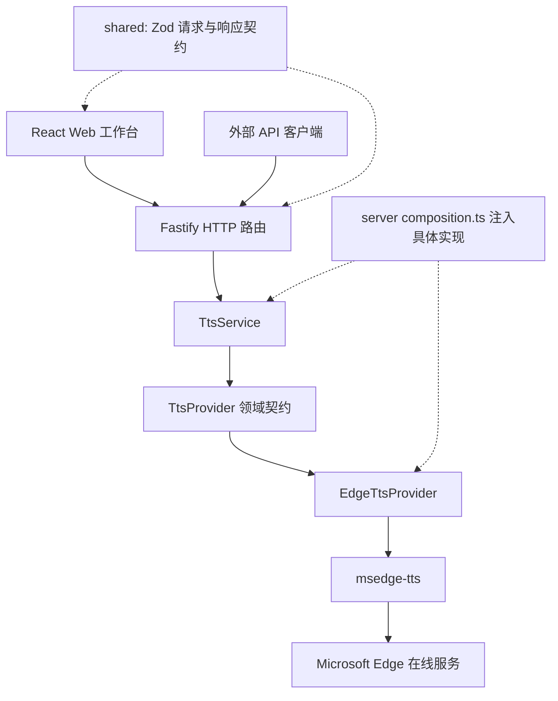

# edgeTTS 架构、需求与消融实验

分析日期：2026-09-22。业务源码基线：`22c9b40c97ca441ad447025904f24c3afe4b280c`（0.5.0）。

本次针对软件机制做单因素消融：每次只移除一个机制，观察调用次数、容量、兼容行为和回归断言的变化。项目不训练语音模型，因此这些结果不代表音质、MOS、真实首音延迟或微软上游吞吐量的变化。业务实现保持不变；新增实验工具、四个负载检查，加强已有播放进度测试，并修正本地 HTTP 测试的连接清理。

## 功能与需求边界

这是一个依赖微软在线服务的单进程、自托管语音 API 与 Web 工作台。主要用户是个人、可信小团队以及允许配置服务地址和 Edge 音色 ID 的 API 客户端。此用户定位是由单密钥、全进程配额和无租户模型推断出的适用范围，并非新增产品需求。

| 需求       | 已实现行为                                                       | 边界                                                              |
| ---------- | ---------------------------------------------------------------- | ----------------------------------------------------------------- |
| 文本转语音 | 两条 POST 接口输出 48/96 kbps MP3                                | 依赖微软服务；非离线引擎                                          |
| 客户端兼容 | `/v1/audio/speech` 接受指定的 OpenAI 请求字段子集                | `tts-1`/`tts-1-hd` 是格式选择；不映射 OpenAI 音色别名             |
| 长文本     | `/api/speech` 接受最多 20,000 Unicode 码点                       | 兼容接口限制为 4,096 UTF-16 代码单元，二者计数单位不同            |
| 韵律控制   | speed 0.5–2、pitch -12–12 半音、volume 0–1                       | 原生接口支持全部；兼容接口提供 speed                              |
| 音色发现   | 音色 ID、显示名、locale、gender 等元数据                         | 查询独立于合成，不要求合成前查询或验证音色是否在缓存中            |
| Web 工作台 | 四种界面语言、音色检索/筛选/收藏、参数偏好、TXT 导入、播放与下载 | TXT 为 UTF-8、最多 256 KiB 且满足文本上限；读取在本地，合成才上传 |
| 流式体验   | 浏览器支持 `audio/mpeg` MediaSource 时渐进播放，否则 Blob 回退   | 为下载保留音频块，浏览器内存会随音频总量增长                      |
| 资源保护   | 认证、请求频率限制、活跃流上限、FIFO 有界队列、取消和超时        | 单进程共享，没有多租户配额或分布式调度                            |
| 部署与隐私 | 一个 Fastify 进程托管 API 和静态页面；Docker/反向代理方案        | 服务不持久化合成文本和音频；文本仍发送给微软                      |

没有发现账户系统、数据库、历史音频库、离线模型、声音克隆、多提供者切换界面或跨进程任务队列。现有接口抽象支持替换 Provider，但只有 Edge 的生产实现。

## 架构与实际调用路径



| 模块                     | 职责与依赖约束                                                           |
| ------------------------ | ------------------------------------------------------------------------ |
| `apps/server`            | 组合根、HTTP DTO 转换、鉴权、准入限流、HTTP 错误映射、静态资源、进程关闭 |
| `packages/tts-service`   | 音色缓存、并发许可、分段编排、迭代器生命周期；运行时只依赖 core          |
| `packages/tts-core`      | Provider 中立的请求、音色、格式、异步音频流和 AbortSignal 契约           |
| `packages/edge-provider` | Edge 音色映射、SSML 文本转义、韵律适配、WebSocket 建立/取消/清理         |
| `packages/shared`        | 前后端共享的 Zod 协议与字符校验；没有被引入 core                         |
| `apps/web`               | 表单、偏好、音色目录、结果快照、请求取消、播放会话及 Blob URL 回收       |

两条 HTTP 合成路由实际都调用 `TtsService.synthesizeSegmented()`，统一使用 300 码点分段。公开的单段 `synthesize()` 仍供包级调用、测试和 smoke 使用。HTTP 路由没有直接创建 Provider；service 的 Edge 开发依赖用于 smoke，不构成运行时依赖倒置。

合成路径为：认证 → 全局频次准入 → schema 校验 → 分段并过滤纯空白段 → 获取一个会话许可 → 首段上游建立 → 按消费进度逐段串行生成 → `Readable.from()` 返回单个 HTTP 音频流。首段可在后续段尚未开始时输出，不预先合成所有段。

许可覆盖整个长文本会话，而不是一次 `provider.synthesize()` 调用。结束、异常、消费者提前 return/throw、客户端取消都必须回收。Provider 还处理“超时或取消后，连接建立结果才迟到”的情况，再次 close 用于清理迟到资源；它与只允许归还一次并发许可是不同的生命周期要求。

## 关键设计及其代价

| 机制                       | 解决的问题                               | 代价或限制                                   |
| -------------------------- | ---------------------------------------- | -------------------------------------------- |
| 6 小时音色缓存             | 减少重复上游查询                         | 元数据可以短期滞后                           |
| in-flight 请求合并         | 多个冷缓存请求共享一次查询               | 共享请求必须在成功或失败后解除               |
| 旧缓存回退 + 5 秒退避      | 已有数据时承受刷新故障，减少连续失败请求 | 冷缓存没有旧值可用；当前没有旧值最大陈旧期限 |
| 返回副本                   | 防止调用方或上游对象污染缓存             | 每次复制音色数组及浅对象；当前字段均为标量   |
| 4 活跃 + 16 排队           | 控制持续占用的上游会话数量               | 饱和时会等待或拒绝，而非无限接纳             |
| 两路由共享 12 次/10 秒预算 | 控制请求进入速度，防止轮换接口绕过       | 所有调用者共享；与活跃流上限处理不同维度     |
| 自然边界 + Unicode 分段    | 保留段落/句子边界，避免错误字符计数      | 比硬切分复杂；本次没有测听感或证明 300 最优  |
| 串行分段且会话持有许可     | 控制资源并保持长文本连续性               | 长请求可较久占用槽位；没有分段预取并行化     |
| MSE + Blob 回退            | 渐进体验与浏览器兼容                     | 双路径及媒体资源回收增加前端状态复杂度       |
| 32 KiB 进度节流            | 减少小网络块触发 UI 状态更新             | 不是每块都显示进度，结束时补最终字节数       |

队列等待期限为 30 秒；Provider 建立期限为 10 秒、音频空闲期限为 120 秒，均不是总合成时长保证。客户端合成请求等待响应头的超时为 45 秒。`/health` 和 `/api/health` 只报告 HTTP 进程存活。

传输开始前的错误可以返回 JSON；开始后出错只能终止音频流，先前的 HTTP 200 不证明文件完整。浏览器保存的是音色/参数等非敏感偏好，API Key 在运行时内存中；下载结果使用生成时参数快照，避免后续编辑影响旧结果说明。

## 实验方法

入口为 `node scripts/ablation.mjs`，需先安装锁定依赖并执行 `pnpm build`。配置在 `scripts/ablation.config.mjs`。不增加运行时开关，不安装新的项目依赖。

1. 对 service、Provider、HTTP 准入、浏览器播放四组分别执行未消融基线。
2. 每个变体启动独立 Vitest 进程；Vite 的 pre-transform 只修改精确匹配的业务模块文本。
3. 校验替换锚点出现次数，并记录模块确实加载该替换的标记。
4. 原有测试不按变体修改，比较同组测试总数。所有变体都从原始代码开始，不叠加消融。
5. 保存 JSON、失败测试名、异常及日志；结束时确认所有目标业务源码的 SHA-256 未改变。

这是固定负载、确定性故障注入实验，主要观测功能与资源契约。失败用例数反映当前测试集的敏感度，不能用来排名模块重要性，更不是线上失败概率。HTTP 使用进程内注入，Provider 使用测试替身，播放使用 jsdom/MediaSource 替身；本次变体不覆盖真实微软连接或真实浏览器解码。

基线测试：service 160、Provider 29、HTTP 21、播放 17，均全部通过。service 基线包含本次新增的四个负载检查；播放基线包含加强后的小块输入检查。

## 消融结果

下表结果已在 Windows 和 Debian WSL2 分别复现，全部 20 次运行（4 个基线 + 16 个变体）的通过/失败计数一致。结构化结果、源码哈希与完整失败用例名称见 [ablation-results.json](ablation-results.json)。

| 单项消融                              | 失败/同组总数 | 观测与结论                                                                                  |
| ------------------------------------- | ------------- | ------------------------------------------------------------------------------------------- |
| 去掉 TTL 命中                         | 7/160         | 100 次顺序读取，上游调用从 1 增至 100；保留缓存                                             |
| 去掉 in-flight 合并                   | 4/160         | 20 个并发冷读取，上游调用从 1 增至 20；保留合并                                             |
| 去掉刷新失败时旧值回退                | 3/160         | 故障期间 20 次读取成功数从 20 降到 19；其余请求仍被独立保留的退避分支返回旧值               |
| 去掉错误退避                          | 3/160         | 相同窗口内 20 次故障期读取，失败刷新尝试从 1 增至 20；保留退避                              |
| 去掉缓存副本                          | 2/160         | 调用方/上游的对象修改污染缓存；保留隔离                                                     |
| 去掉活跃许可上限                      | 15/160        | 24 请求负载的活跃许可从 4 增至 24；另出现 1 个未处理错误，独立记录，不冒充断言失败          |
| 去掉排队容量上限                      | 6/160         | 24 请求的排队/拒绝从 16/4 变为 20/0；保留有界队列                                           |
| 去掉自然边界选择，保留码点硬切        | 15/160        | 段落/句子切分及依赖段边界的编排断言变化；证明契约受损，不直接证明听感变差                   |
| 将分段索引退化为 UTF-16 单元          | 1/160         | 5 个 emoji、上限 2 时，从 3 段变成 5 段；测试证明码点计数差异，不泛称所有样本都发生字符损坏 |
| 返回长文本流时提前释放许可            | 2/160         | 排队请求无需等整个会话结束；保留会话级许可                                                  |
| 去掉纯空白段过滤                      | 1/160         | 有效长文本遇到纯空白段的回归失败；保留过滤                                                  |
| 去掉迟到 setMetadata 结果的二次 close | 4/29          | 取消/超时后的迟到结果只 close 一次，预期为两次；保留迟到清理                                |
| 去掉 hook 参数中的 groupId 字段       | 0/21          | 当前实现与依赖组合中冗余，见下文；不意味着全局预算可删除                                    |
| 将共享预算改为按路由分桶              | 1/21          | 应返回 429 的跨路由请求得到 200；共享预算必须保留                                           |
| 去掉 Blob 回退                        | 6/17          | 无 MSE 及 addSourceBuffer 失败场景失去播放/下载兼容路径                                     |
| 去掉播放进度节流                      | 1/17          | 相同 74 KiB、小块流的回调从 3 增至 65；保留节流                                             |

本轮 16 个变体中，15 个被断言识别，1 个存活。所有基线没有未处理错误；去掉活跃上限的变体产生一个额外的未处理错误，应与正常基线验证结果分开看。

### 对两个初始“全绿”结果的复查

**groupId 是当前实现中的冗余字段。** `createSpeechRateLimiter()` 创建一个 hook，并被两条路由复用；固定 `keyGenerator` 和同一个内部 store 提供共享预算。锁定的 `@fastify/rate-limit` 实现中，实际拼接 key 时读取 `req.routeOptions.config?.rateLimit?.groupId`，而这里的字段放在手动 hook 的参数中，没有在路由配置上设置。删除字段后的 21 个 HTTP 测试全部通过；将 key 改为路由 URL 后，跨路由预算测试失败，形成对照。这个结论仅适用于当前调用方式与锁定依赖版本。

**进度节流最初存活是测试负载没有区分度。** 原测试主要提供 32 KiB、32 KiB、10 KiB 三个非空块，逐块报告和节流报告都恰好得到三次回调。现在保留原负载，并增加把前 64 KiB 分成 64 个 1 KiB 小块的情况，同时把回调次数断言收紧为恰好 3。移除节流后实际收到 65 次，明确测到 62 次额外回调；这不是 62 次实际 React 渲染或 CPU 耗时的测量。

## 取舍建议

- 保留缓存命中、请求合并、故障回退/退避、并发与队列上限、共享准入预算及完整取消清理。实验已经给出具体负载或故障触发条件。
- `groupId` 字段可以作为后续一行清理候选；本轮只提交分析、实验与测试，保留业务实现，方便复现实验基线。
- 自然边界分段与 Blob 回退分别承担文本契约和浏览器兼容需求。只有明确缩减产品需求后才适合移除。
- 300 码点、4/16 容量、6 小时 TTL、5 秒退避仍是配置选择；“机制不可随便删”不等于“这些数值已最优”。
- 下一次如需调参，应固定多语言语料、不同长度与并发负载，测真实首个可解码音频、总时长、峰值内存和取消恢复；听感需要独立评价。不要从本次断言失败数量推导调参结论。

## 复现与验证记录

```powershell
linux-task.ps1 -Mode build -Project 'D:\Forgejo\edgeTTS' -Command 'pnpm install --frozen-lockfile && pnpm build && node scripts/ablation.mjs'
```

输出写入 `coverage/ablation/<UTC 时间>/`，其中 `summary.json` 包含目标源码哈希、精确变体、失败测试与未处理异常；该目录被 Git 忽略。应保存当前结果再运行镜像同步，构建目录可以被重新创建。

本机起初存在两个环境问题：WSL 直连 npm 超时，显式使用现有本地 HTTP 代理成功；Windows 的 CRLF checkout 使 pnpm 补丁解析及 Prettier 检查失败。安装时只为命令设置代理，项目临时目录安装所需 pnpm 12.3.4，未修改系统或全局工具；规范化工作区文本到 Git 中已有的 LF 后，未产生额外的业务源码 diff。

验证环境为 Node 24.21.0、pnpm 12.3.4、Vitest 4.1.11。Debian WSL2 通过 `linux-task.ps1 -Mode build` 执行了以下全部命令：

| 验证                                   | 结果                                                 |
| -------------------------------------- | ---------------------------------------------------- |
| `pnpm install --frozen-lockfile`       | 通过，使用现有 HTTP 代理的显式命令参数               |
| `pnpm build`                           | 通过                                                 |
| `pnpm typecheck`                       | 通过                                                 |
| `pnpm lint`                            | 通过                                                 |
| `pnpm test`                            | 635 个应用/包测试 + 57 个发布治理检查通过            |
| `pnpm format:check`                    | 通过                                                 |
| `node scripts/ablation.mjs`            | 4 个基线通过；16 个消融变体完成，与 Windows 计数一致 |
| Windows `git diff --check`（含暂存区） | 通过                                                 |

首次 Linux 全量测试中，两个原有断连用例在业务断言之后的 `afterEach → app.close()` 超时；修正仅在该本地 HTTP 测试组的 teardown 中启动关闭后释放测试连接，不更改业务取消逻辑，不放宽断言。修正后 Linux 154 个 server 测试全部通过，Windows 的 44 个 speech 测试也通过。前端既有 i18n 测试仍输出 React `act(...)` 警告，未产生失败断言。

未执行微软在线 smoke、Docker 镜像/反向代理契约或真实浏览器播放验证；本轮未修改业务运行时与部署配置，这些不属于消融证据。完整 Linux 原始结果已按单个实验产物目录复制到 Windows 的 `coverage/ablation/linux-2026-09-22T00-50-19.171Z/`，未回写构建镜像源码。
