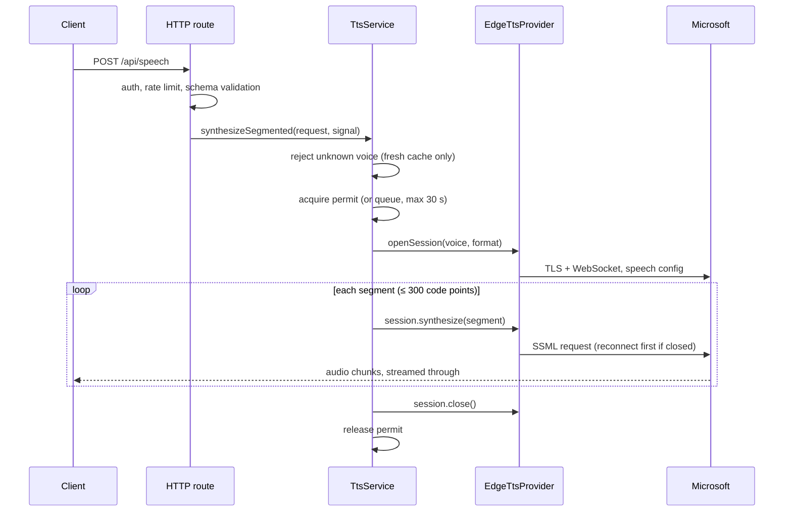

# Architecture and design decisions

This document explains how a request flows through edgeTTS, which resources it holds, and
why the main design choices were made. Deployment and API usage are covered in the
[deployment guide](deployment.md) and the [API reference](api.md).

## Layers

```text
HTTP routes (apps/server)          validation, auth, rate limits, error mapping
      ↓
TtsService (packages/tts-service)  voice cache, concurrency permits, segmentation
      ↓
TtsProvider (packages/tts-core)    provider-neutral contract and domain errors
      ↓
EdgeTtsProvider (edge-provider)    connection setup, timeouts, XML escaping
      ↓
msedge-tts                         Microsoft Edge Read Aloud WebSocket client
```

`packages/shared` holds the request and response schemas used by the server and the browser.
Only `apps/server/src/composition.ts` constructs `EdgeTtsProvider`. These import boundaries
are enforced by `no-restricted-imports` in `eslint.config.js` and verified by
`pnpm test:architecture`, so a violation fails CI rather than waiting for review.

Configuration is read once at startup by `loadServerConfig` (`apps/server/src/config.ts`).
Every invalid variable is reported together and the process exits before listening.

## Long-text request lifecycle



The response status and headers are sent once the first segment has started, so a failure
after that point cannot become a JSON error: the connection is terminated instead. Clients
must treat a truncated stream as a failure.

## Resources and cancellation

- **One permit per request.** A long-text request holds a single concurrency permit from its
  first segment to its last.
- **One upstream connection per request.** Providers may implement the optional
  `openSession`. The service then synthesizes every segment on one session; otherwise it calls
  `synthesize` once per segment.
- **Released together, exactly once.** `SegmentedAudioStream` closes the session and releases
  the permit in one place, which every terminal path reaches: completion, upstream error,
  client disconnect and a consumer that stops reading.
- **Cancellation is a signal.** The route aborts an `AbortSignal` when the client disconnects.
  The service, provider and each audio stream listen to it, so a disconnect stops the upstream
  synthesis and frees capacity immediately.
- **Timeouts are per phase.** Connection setup (`EDGE_SETUP_TIMEOUT_MS`), the gap between audio
  chunks (`EDGE_AUDIO_IDLE_TIMEOUT_MS`) and the queue wait are bounded separately. The total
  duration of an admitted stream is not.

## Decisions

### Hold one permit for a whole long-text request

Releasing the permit between segments would let queued requests interleave with a stream in
progress and stall its audio. The [ablation experiments](ablation.zh-CN.md) confirm that
queued requests are only admitted after the whole session ends.

### Share one speech budget across both speech routes

Both routes synthesize through the same upstream, so separate per-route budgets would double
the effective limit. The ablation experiments show that per-route keys let a cross-route
request through that should get `429`. `SPEECH_RATE_LIMIT_SCOPE=ip` changes who shares a
budget, not which routes share it.

### Reuse one connection per request; do not prefetch

Measured against the live service, each new connection cost about 1.5–2 s. Reusing one
connection halved long-text delivery time. Prefetching the next segment recovered about
half of that gain while doubling concurrent upstream connections. See the
[performance measurements](performance.zh-CN.md).

### Reconnect explicitly before each session segment

msedge-tts silently reconnects inside a send when the socket is closed, and a failed
reconnect there becomes an unhandled rejection that would crash the process. The session
therefore re-runs setup before every segment: a no-op while connected, and a reconnect
bounded by the setup timeout otherwise. The repository also patches msedge-tts to ignore
frames that arrive for a stream that was already cancelled.

### Validate voices against the cache without fetching

`UNKNOWN_VOICE` is only returned when a fresh cached catalog lacks the voice, compared
case-insensitively. Synthesis never waits on voice discovery, so a slow or failing catalog
endpoint cannot delay or block speech. Without a fresh catalog, the upstream decides.

### No readiness endpoint

A readiness probe tied to Microsoft availability would remove every instance from rotation
during an upstream outage. Without that tie it would duplicate `/health`, and Fastify already
answers `503` while shutting down. Upstream health is observable through the optional
metrics instead.

### Log validation failures without values

Zod issues echo rejected values and unknown key names. Warnings keep only issue codes and
field paths, so request content never reaches logs. Synthesis text is never logged.
